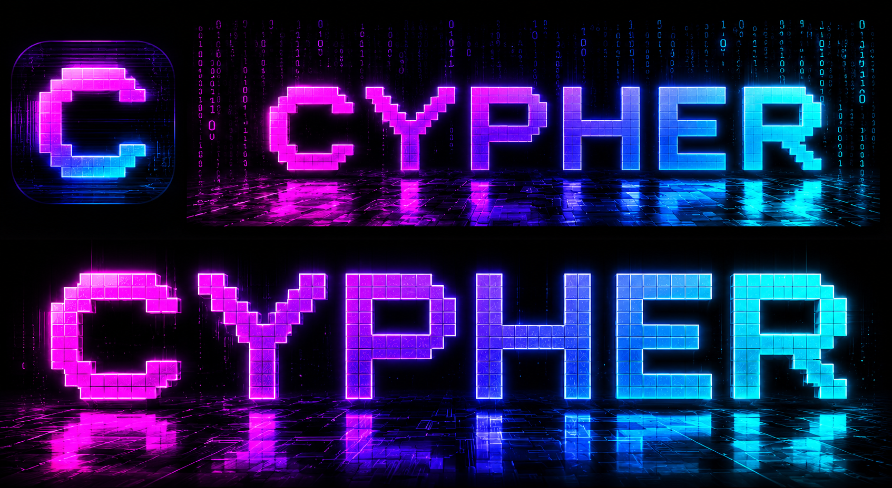

<p align="center">\n  

Universal **lossless file ↔ audio codec**.

Convert **files, folders, repositories or bundles** into self-contained encrypted audio containers.

```txt
ANY DATA
↓
compression
↓
encryption
↓
audio transport
↓
FLAC / WAV
```

Restore everything **bit-perfect**.

No sidecar files.  
No external metadata.  
One portable audio artifact.

---

## Features

- universal file support
- folders + multi-file bundles
- lossless encode / decode
- FLAC / WAV transport
- chunked large payload support
- relative path preservation
- SHA256 integrity verification
- X25519 + AES-GCM encryption
- multi-recipient encryption
- Touch ID + macOS Keychain workflow
- CLI + GUI

Supports:

- images
- PDFs
- videos
- source code
- archives
- binaries
- documents
- arbitrary MIME types

---

## Quick Start

Install:

```bash
python -m venv .venv
source .venv/bin/activate
pip install -e .
```

Generate keys:

```bash
make keygen
```

Encode:

```bash
make encode rapport.pdf
```

Bundle a folder:

```bash
make bundle data/input/project
```

Decode:

```bash
make decode payload.flac
```

Inspect:

```bash
make inspect payload.flac
```

Launch GUI:

```bash
make gui
```

---

## GUI

Two built-in interfaces.

### Obsidian Purple

Operator-style cyber console.

- clean structured logs
- dashboard telemetry
- progress + ETA
- artifact tracking
- atmospheric soundtrack

### Matrix

Encrypted signal mode.

- green cryptographic styling
- obfuscated visual logs
- live telemetry
- matrix-style execution atmosphere

---

## Security

Encryption backend:

```txt
X25519
+
AES-GCM
+
HKDF-SHA256
```

Private key workflow:

```txt
encrypted private PEM
+
macOS Keychain
+
Touch ID authentication
```

Integrity:

```txt
SHA256 checksum verification
```

---

## Philosophy

`cypher` treats audio as a **universal transport layer**.

Files become:

```txt
compressed
encrypted
self-contained
portable
audio artifacts
```

Simple.

Weird.

Lossless.

---

## Future Directions

- digital signatures
- Brotli / LZMA backends
- adaptive compression
- Reed-Solomon correction
- distributed payload splitting
- payload deduplication
- steganographic transport
- progressive recovery
